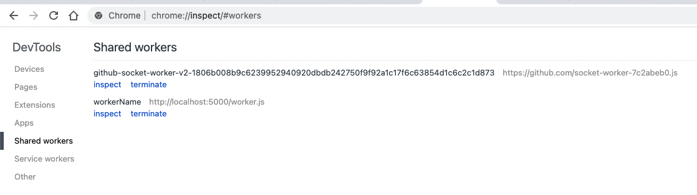
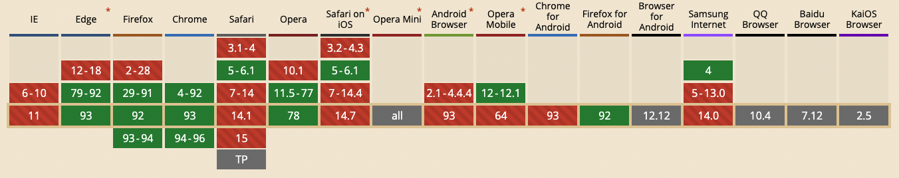

## SharedWorker
一种特殊的 `Web Worker`。特殊在，这种 `Worker` 可在**同源**下不同标签页或 `iframe` 所共享，所以可用其跨页面通讯。

### 创建 SharedWorker
和普通 `Web Worker` 用法一样，传入 js url 即可：

``` js
const sharedworker = new SharedWorker('worker.js', 'workerName')
const messagePort = sharedworker.port

messagePort.onmessage = evt => {
  console.log('index.html ..', evt.data)
}

function btnClick() {
  messagePort.postMessage('index')
}

// 页面卸载前，删除该页面之前连接 SharedWorker 所产生的 port
window.onbeforeunload = function() {
  sharedworker.port.postMessage('onbeforeunload')
}
```

`SharedWorker` 的实例下的 `port` 属性用来：
- 监听共享 Worker 传递过来的信息
- 向共享 Worker 传递信息

### 查看和调试 ShareWorker
打开浏览器的 url `chrome://inspect`，选择 `Shared workers` 一栏。即可看到当前浏览器正在使用的 `SharedWorker` 列表：



点击 `terminate`: 终止此 `SharedWorker`。<br />
点击 `inspect`: 打开 `ShareWorker` 的调试窗口。

### ShareWorker 连接不同页面
可通过监听 window 的 `connect` 方法，使得 `ShareWorker` 连接页面，回调函数的 `ports` 是页面连接 `ShareWorker` 的集合。

> 不同的页面，连接后产生的 port 不一样。ports 就是所有 port 的数组。

``` js
// worker.js

const ports = []                // 全局存储所有 ports

onconnect = e => {
  const port = e.ports[0]       // 加入新的 port
  ports.push(port)

  // 给新的 ShareWorker 注册事件，用来监听页面向 worker 发出的 postMessage
  port.onmessage = e => {     
    // 页面卸载前，删除该页面之前连接 SharedWorker 所产生的 port
    if (e.data === 'onbeforeunload') {
      let i = ports.indexOf(e.target)
      ports.splice(i, 1)
      return
    }

    // 打印页面向 ShareWorker 传递的信息，当前 ShareWorker 所存放的 ports 长度
    console.log('worker.js: ', e.data, ports.length)

    // 给所有页面发送信息
    ports.forEach(p => p.postMessage(e.data))
  }
}
```

<video id="video" controls="" preload="none">
  <source
    src="mov/SharedWorker-demo.mov" 
    type="video/mp4"
  ></source>
</video>

### 兼容性
IE 不兼容，Safari 浏览器不兼容（Webkit 引擎限制），移动端浏览器不兼容：



### refs
- [MDN SharedWorker](https://developer.mozilla.org/zh-CN/docs/Web/API/SharedWorker)
- [Safari 为何放弃对 SharedWorker 的支持?](https://stackoverflow.com/questions/28310501/why-did-safari-drop-support-for-sharedworker)
